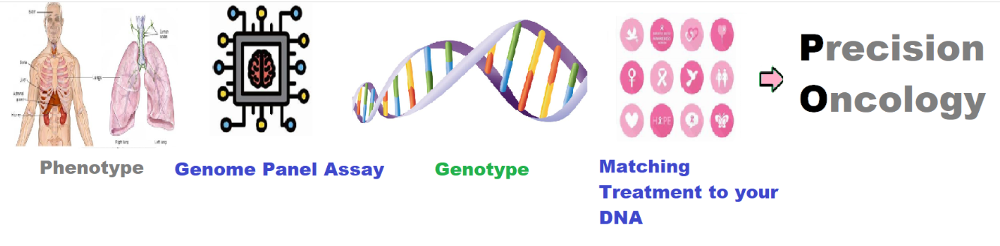

    
# Precision Oncology 

## Analysis of needs for current state of precision oncology.

    

    

**Precision oncology**, also known as personalized or molecular oncology, is an approach to cancer treatment that involves tailoring therapies to individual patients based on the specific genetic alterations, biomarkers, and molecular characteristics of their tumors. It aims to maximize treatment efficacy while minimizing side effects by matching patients with targeted therapies or immunotherapies that are most likely to be effective against their particular type of cancer.

In precision oncology, tumor profiling techniques, such as **next-generation sequencing (NGS)**, are used to identify genetic mutations, alterations, and other molecular features unique to each patient's tumor. This information helps oncologists select the most appropriate treatment options, including targeted therapies that directly interfere with the molecular pathways driving cancer growth or immunotherapies that harness the body's immune system to attack cancer cells.

The effectiveness of precision oncology in improving outcomes for cancer patients has been demonstrated in various studies and clinical trials across different cancer types. By targeting specific **molecular vulnerabilities** or immune checkpoints, precision oncology has led to significant improvements in response rates, progression-free survival, and overall survival for some patients compared to traditional chemotherapy or other standard treatments. Additionally, precision oncology allows for the identification of rare or novel genetic alterations that may not respond to conventional therapies, offering new treatment options for patients with refractory or advanced-stage cancers.

However, it's important to note that precision oncology is still a relatively new and evolving field, and its success may vary depending on factors such as tumor type, genetic complexity, treatment accessibility, and patient-specific characteristics. While precision oncology has shown promise in certain cases, it may not be effective for all patients or cancer types. Ongoing research, advancements in technology, and improvements in treatment strategies are continuously shaping the field of precision oncology, with the goal of further optimizing personalized cancer care and improving outcomes for patients.

    

    
## Getting Started

The goal of this solution is to **Jump Start** your development and have you up and running in 30 minutes. 

To get started with the **Precision Oncology** solution repository, follow these steps:
1. Clone the repository to your local machine.
2. Install the required dependencies listed at the top of the notebook.
3. Explore the example code provided in the repository and experiment.
4. Run the notebook and make it your own - **EASY !**
    
## Solution Features

- Easy to understand and use  
- Easily Configurable 
- Quickly start your project with pre-built templates
- Its Fast and Automated
- Saves You Time 

## ⚙️ Key Features

- ✅ **Self Documenting** Automatically identifies and annotates major steps in a notebook, making the codebase readable and well structured.
- ✅ **Self Testing** Includes built in **unit tests** for each function to validate logic and ensure code reliability.
- ✅ **Easily Configurable** Uses a simple **config.ini** file for centralized settings and easy customization through key value pairs.
- ✅ **Talking Code** explains itself through inline commentary, helping you understand both **what** it does and **why** it does it.
- ✅ **Self Logging** extends Python’s standard **logging** module for **step by step runtime insights**.
- ✅ **Self Debugging** Includes debugging hooks and detailed error tracing to simplify development and troubleshooting.
- ✅ **Low Code or  No Code** Designed to minimize complexity — most full solutions are under 50 lines of code.
- ✅ **Educational** Each template includes educational narrative and background context to support learning, teaching, and collaborative development.

    